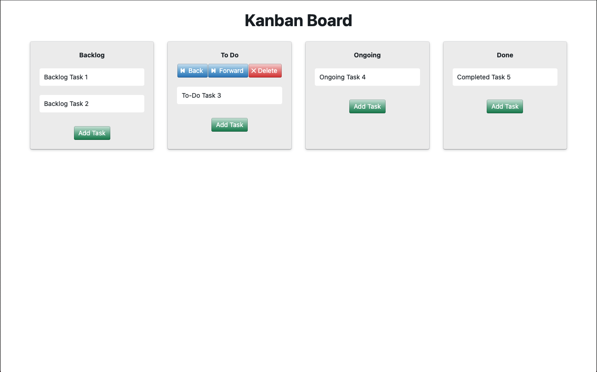

# Kanban Board 
First off, thank you for taking your time to review my work, I really appreciate it!

This project utilizes a Kanban Board, which is an agile project management tool designed to help visualize work, limit work-in-progress, and maximize efficiency (or flow).

### Tech Stack
* ReactJS
    * React Hooks

Please feel free to clone this project and run it on your own machine with these commands
